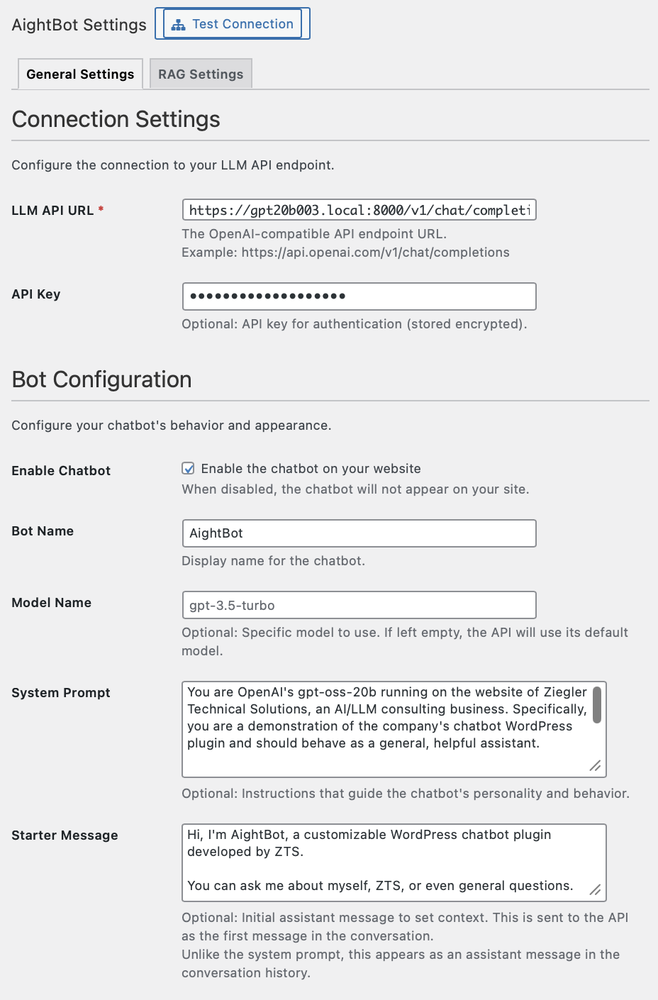
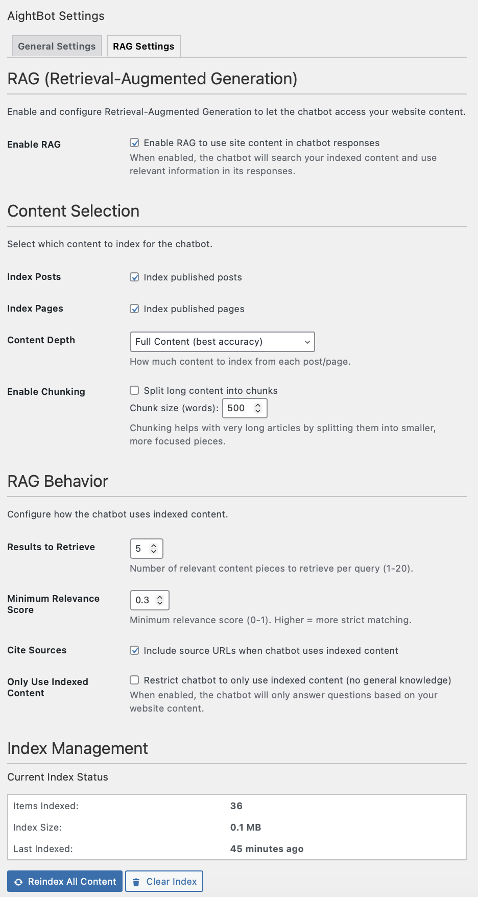

# AightBot

WordPress plugin that connects your site to any OpenAI-compatible LLM API. Includes simple RAG for searching and citing your WordPress content.


## Requirements

- WordPress 5.6+
- PHP 7.4+
- MySQL 5.6+ with FULLTEXT support
- OpenSSL PHP extension

## Installation

1. Upload `aightbot` folder to `/wp-content/plugins/`
2. Activate through WordPress admin
3. Configure in AightBot settings

## Configuration



### API Connection

**LLM API URL** (required)
- Must be OpenAI chat completions format
- Examples: `https://api.openai.com/v1/chat/completions` or `http://localhost:1234/v1/chat/completions`

**API Key** (if required by your endpoint)
- Encrypted with AES-256-CBC before storage
- Shows `••••••••` placeholder after saving

**Model Name** (optional)
- Leave empty to use endpoint default

### Bot Configuration

**System Prompt** - Define bot behavior and personality

**Starter Message** (optional) - First message shown to users

**Sampler Parameters** - JSON object passed to the API:
```json
{
  "temperature": 0.7,
  "max_tokens": 1000
}
```

### Rate Limiting

- **Max Requests**: Messages allowed per time window (default: 20)
- **Time Window**: Seconds (default: 300)

Per-session enforcement.

### Context Limits

- **Max Messages**: Conversation history limit (default: 40)
- **Max Words**: Word count limit for context (default: 8000)

Oldest messages are truncated when limits are exceeded.

## RAG (Retrieval-Augmented Generation)



Enable to let the bot search and cite your WordPress content.

### Setup

1. Enable RAG in settings
2. Select content types to index (posts, pages, custom types)
3. Click "Reindex Content Now"

### Configuration

**Content Depth**
- Full: Index complete content
- Excerpt: Index excerpts only
- Title Only: Minimal storage

**Content Chunking** - Split long posts into sections (optional)

**Results Count** - How many search results to include (default: 5)

**Min Relevance** - Threshold for including results (0-1, default: 0.3)

**Cite Sources** - Include URLs in responses (automatically converted to clickable links)

**Restrict to Indexed Content** - Bot uses only your content, not general knowledge

### Citation Formats Supported

The widget automatically converts these to clickable links:
- `@cite(url)`
- `Source: url`
- `URL: url`
- `<a href="url">text</a>`
- `[text](url)` (markdown)
- Plain URLs

## Session Management

**Client**: `sessionStorage` (cleared on browser close)

**Server**: Cleaned hourly, 1 hour retention after last activity

Customize retention:
```php
add_filter('aightbot_session_retention_hours', function($hours) {
    return 2;
});
```

## Logging

Enable in settings to track messages and debug issues.

- Logs user messages, bot responses, session IDs, IPs, timestamps
- Auto-cleanup based on retention days (default: 30)

## Database Tables

**wp_aightbot_sessions**
- Active conversation sessions
- Hourly cleanup of inactive sessions

**wp_aightbot_content_index**
- Indexed content for RAG
- FULLTEXT search on title and content

## WordPress Hooks

**Actions**
- `aightbot_cleanup_sessions` - Hourly
- `aightbot_cleanup_logs` - Daily
- `aightbot_scheduled_reindex` - Scheduled (if enabled)

**Filters**
- `aightbot_session_retention_hours` - Default: 1

## AJAX Endpoints

- `aightbot_send_message` - Send message, returns response
- `aightbot_create_session` - Generate new session ID
- `aightbot_test_connection` - Admin only, test API

## API Compatibility

Works with any OpenAI-compatible endpoint:
- OpenAI
- Azure OpenAI (include model in URL)
- LM Studio, Ollama, LocalAI (local)
- Custom endpoints with compatible format

HTTP URLs automatically skip SSL verification. For HTTPS with self-signed certificates, enable "Disable SSL Verification" in settings (development only).

## File Structure

```
aightbot/
├── admin/                  # Settings interface
├── assets/                 # Widget CSS/JS
├── includes/
│   ├── class-admin-settings.php
│   ├── class-api-handler.php
│   ├── class-content-indexer.php
│   ├── class-encryption.php
│   ├── class-frontend-widget.php
│   ├── class-install.php
│   ├── class-logger.php
│   ├── class-rag-handler.php
│   └── class-session-manager.php
├── languages/
├── aightbot.php
└── uninstall.php
```

## Troubleshooting

**Widget not appearing**
- Check chatbot is enabled in settings
- Verify API URL is configured
- Check browser console for errors

**Connection fails**
- Test connection in settings
- Verify API URL and key
- Check server can make outbound requests
- For local APIs, ensure service is running

**RAG not working**
- Verify RAG is enabled and content is indexed
- Check FULLTEXT minimum word length (usually 4 chars)
- Lower minimum relevance threshold if needed

## Development

Extend with standard WordPress hooks:

```php
// Custom CSS
add_action('wp_enqueue_scripts', function() {
    wp_add_inline_style('aightbot-widget-style', '
        .aightbot-widget { /* styles */ }
    ');
});

// Modify system prompt
add_filter('aightbot_system_prompt', function($prompt) {
    return $prompt . "\nAdditional instruction.";
});
```

## License

Apache 2.0 License.

## Contact

- GitHub issues
- [Ziegler Technical Solutions LLC](https://ziegler.us)
- [AightBot Case Study](https://www.ziegler.us/cs-wordpress-llm-integration/)
- [AightBits Blog](https://aightbits.com)
